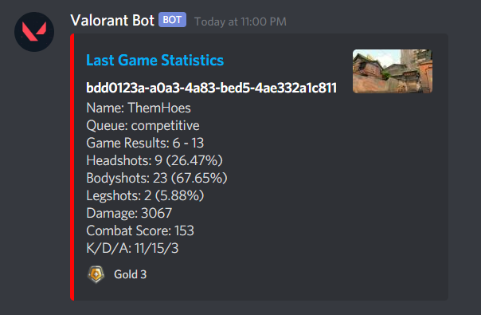

# Valorant Discord Stats

Go implementation to post Valorant stats onto Discord  

[Invite this bot to your server](https://discord.com/oauth2/authorize?client_id=396807688039694346&scope=bot&permissions=68608)   

## Prerequisites

* Installed Go  
* Downloaded blitz.gg application  
* Take note of your nametag from blitz.gg
  * Example: https://blitz.gg/valorant/profile/fompei-na1 -> fompei-na1 is the nametag

## Commands

| Command             | Description                                       |
|---------------------|---------------------------------------------------|
| !commands           | See list of commands you can query                |
| !career \<nametag>   | See hit percentages for your total career         |
| !last20 \<nametag>   | See hit percentages from the last 20 games played |
| !lastgame \<nametag> | See hit percentages from the last game played     |

## Images

## Start Discord Bot

Run `go run main.go -t <token>` to start the Discord bot

Follow this [guide](https://www.writebots.com/discord-bot-token/) up until step 4 to get the token needed to run the bot 

## Install onto EC2 Instance

`sudo yum update`  
`sudo yum install -y git golang`  
`git clone https://github.com/aarlin/valorant-discord-stats.git`  
`sudo amazon-linux-extras install docker`  
`sudo service docker start`  
`sudo usermod -aG docker ec2-user`  
Log out and log back in for usermod changes to take affect

## Build Docker Image

1. Add Discord Oauth token into .env.sample & rename .env.sample to .env
2. Run `docker build -t valorant .`  
3. Run `docker images` and locate the Image ID for valorant
4. Run `docker run -it valorant` OR `docker run -d valorant`  
5. Use `docker ps` for currently running processes  
6. Use `docker exec -it <container_id> /bin/bash` to go inside container

## Todos

- [ ] make unique command call so there is no collision with other bots
- [ ] create online on x number of server as status
- [ ] add agent to last game
- [ ] fix placement for deathmatch
- [ ] fix token replacement issue
- [ ] look into weapon stats

## References

https://developers.google.com/sheets/api/quickstart/go 
